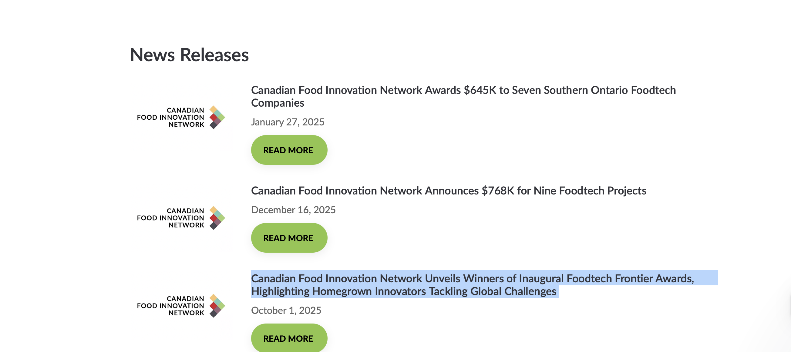

# Blanc Labs Assessment – Strapi + Angular News Releases

## Overview
This repo contains a Strapi backend and an Angular frontend that renders a News Releases page. The backend provides a single "News Release Page" config plus a collection of "News Release" items. The frontend fetches that data, sorts it, paginates it, and renders the list to match the provided design.

## Tech Stack
- Backend: Strapi v5 (Node 20+), SQLite
- Frontend: Angular 21 (standalone components, signals)

## Repository Structure
Top-level:
- `Backend/` Strapi app
- `Frontend/` Angular app
- `.gitignore`

Backend highlights:
- `Backend/config/` Strapi config (server, database, middlewares)
- `Backend/src/api/news-release/` News Release collection type
- `Backend/src/api/news-release-page/` News Release Page single type
- `Backend/database-data/data.db` SQLite database (seed data)
- `Backend/public/uploads/` media files used by news release logos
- `Backend/.env` Strapi env values (local dev)

Frontend highlights:
- `Frontend/src/app/news-releases-page/` News Releases page component + service
- `Frontend/src/app/app.routes.ts` Router configuration
- `Frontend/src/app/app.config.ts` App providers (router + http)
- `Frontend/src/styles.css` Global styles

## Setup (Step-by-Step)

### 1) Prerequisites
- Node.js 20+ (Strapi requires >=20)
- npm 10+ (or yarn/pnpm if you prefer)

### 2) Clone and install dependencies
- Backend:
  - `cd Backend`
  - `npm install`
- Frontend:
  - `cd Frontend`
  - `npm install`

### 3) Configure environment
In this repo exisiting .env file is already provided.

### 4) Run the backend (Strapi)
From `Backend/`:
- `npm run develop`

Strapi will be available at:
- Admin UI: `http://localhost:1337/admin`
- API: `http://localhost:1337/api`

Login Credentials for Admin UI for Strapi
- email: raaghavc@gmail.com
- password: Blanclabs1

### 5) Run the frontend (Angular)
From `Frontend/`:
- `npm start`

Angular dev server will be available at:
- `http://localhost:4200/news-releases`

## Backend Details

### Content Types
News Release Page (single type):
- File: `Backend/src/api/news-release-page/content-types/news-release-page/schema.json`
- Fields:
  - `pageTitle`, `intro`, `defaultLogo`, `showLogos`, `ctaLabel`, `ctaStyle`, `sortMode`, `itemsPerPage`
  - Relation: `news_releases` (one-to-many to News Release)

News Release (collection type):
- File: `Backend/src/api/news-release/content-types/news-release/schema.json`
- Fields:
  - `title`, `publishDate`, `logo`, `externalUrl`, `sortOrder`

### Routes
Strapi uses core routers, so the default REST routes are available:
- Single type: `GET /api/news-release-page`
- Collection: `GET /api/news-releases`

For nested data and logos:
- `GET /api/news-release-page?populate[news_releases][populate]=logo&populate=defaultLogo`

### Database
- SQLite file is configured in `Backend/config/database.ts`.
- The local DB file path is set by `DATABASE_FILENAME` in `.env`.
- Default path used here: `Backend/database-data/data.db`.

### Media
- Media used for logos is stored in `Backend/public/uploads/`.
- If media is missing, logos will not appear in the frontend.

## Frontend Design + Logic

### Route and Components
- Route: `/news-releases` in `Frontend/src/app/app.routes.ts`.
- Component: `Frontend/src/app/news-releases-page/news-releases-page.component.ts`.
- Template: `Frontend/src/app/news-releases-page/news-releases-page.component.html`.
- Styles: `Frontend/src/app/news-releases-page/news-releases-page.component.css`.

### Data Fetching
- Service: `Frontend/src/app/news-releases-page/news-release.service.ts`.
- Calls the following API which automatically populates relational data and image data for News Release page: `http://localhost:1337/api/news-release-page?populate[news_releases][populate]=logo&populate=defaultLogo`.

### Sorting + Pagination
- Sorting logic is controlled by `sortMode`:
  - `publishDate_desc` (default)
  - `publishDate_asc`
  - `manual_sortOrder_asc`
- Pagination uses `itemsPerPage` from the News Release Page.

### Logo and CTA Handling
- Logo priority: `news_release.logo` → fallback to `defaultLogo`.
- CTA label and style come from the page config.
- If `externalUrl` is `null`, the CTA links back to `/news-releases`.

### Design
- Typography and color styling are in `Frontend/src/styles.css`.
- Layout and spacing are in `Frontend/src/app/news-releases-page/news-releases-page.component.css`.

## End-to-End Flow (Full Logic Map)
1. User navigates to `http://localhost:4200/news-releases`.
2. Angular router loads `NewsReleasesPageComponent`.
3. Component calls `NewsReleaseService.getNewsReleasePage()`.
4. Service requests Strapi at `http://localhost:1337/api/news-release-page?...`.
5. Strapi returns News Release Page + related News Releases + logos.
6. Service normalizes the response shape.
7. Component sorts items based on `sortMode` and slices them for pagination.
8. Template renders header, list rows, CTAs, and pagination controls.
